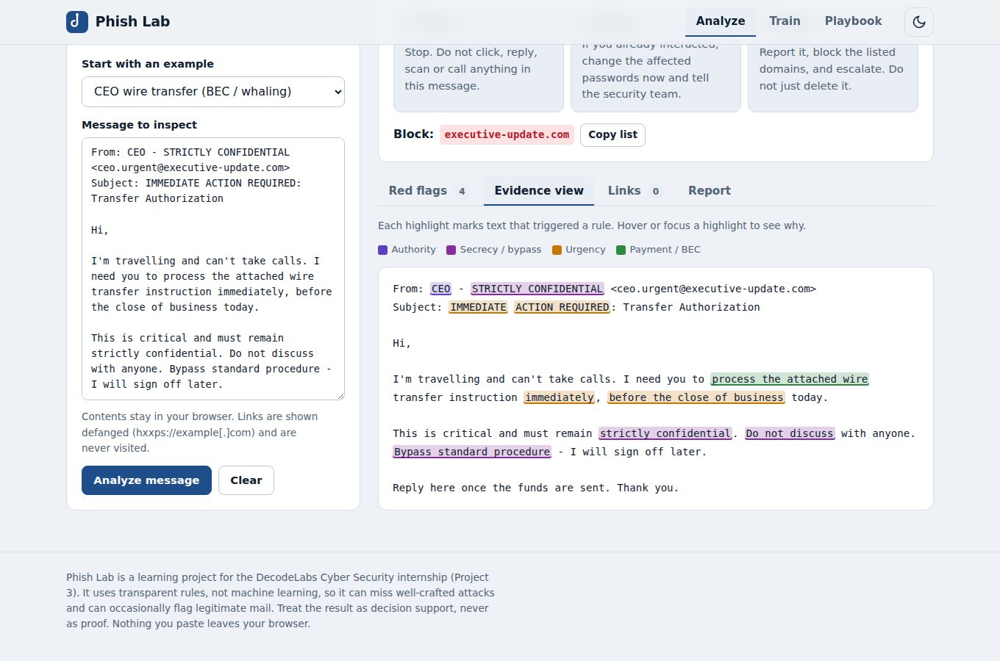
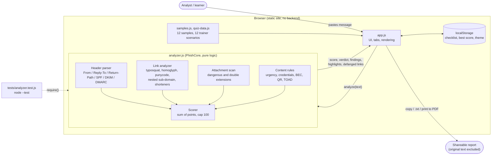
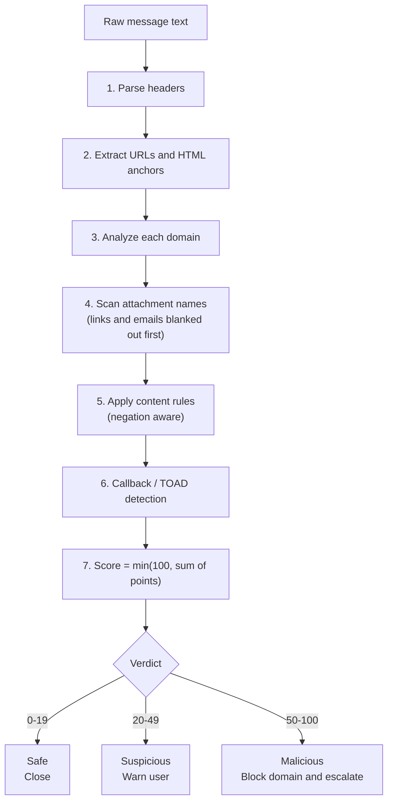

<div align="center">

# 🎣 Phish Lab

**A client-side phishing triage bench and awareness trainer.**
Paste a suspicious message, get an explainable verdict, and learn to spot the next one.

[](https://shadow-exe64.github.io/phish-lab/)
[](https://github.com/Shadow-Exe64/phish-lab/actions)
[](LICENSE)


**Project 3 · Phishing Awareness Analysis** · DecodeLabs Cyber Security Internship, Batch 2026



</div>

---

## Table of contents

- [Overview](#overview)
- [Architecture](#architecture)
- [Features](#features)
- [Requirements to implementation map](#requirements-to-implementation-map)
- [Quick start](#quick-start)
- [How scoring works](#how-scoring-works)
- [Security and privacy design](#security-and-privacy-design)
- [Testing](#testing)
- [Project structure](#project-structure)
- [Limitations](#limitations)
- [Deployment](#deployment)
- [Roadmap](#roadmap)
- [License](#license)

## Overview

Phish Lab takes apart a suspicious email, SMS or chat message the way a SOC analyst would. It lists the **red flags**, breaks down every **link**, explains **why the message is unsafe**, returns a verdict with a **triage action**, and produces a shareable report. A built-in trainer and playbook turn the same ideas into practice for non-experts.

Every point in the risk score is traceable to a named rule, so the verdict can always be justified. There is no machine learning, no backend and no network call.

## Architecture

Phish Lab is a static single-page app. The analysis engine is pure logic with no DOM access, which is why the exact same file runs in the browser and under Node for testing.



### Analysis pipeline



### Design decisions

| Decision | Reason |
| --- | --- |
| Pure-logic engine with a UMD wrapper | One file serves the browser (`window.PhishCore`) and Node (`require`), so the real engine is what the tests run. |
| Rule based, not ML | Every finding carries evidence and a plain-language reason. An analyst can defend the verdict. |
| No network calls, ever | Links are defanged and never fetched, so analysing a malicious URL cannot tip off an attacker or leak the message. |
| `textContent` rendering only | Pasted text is never inserted as HTML, so a hostile message cannot run script in the page. |
| Static hosting | GitHub Pages serves it. Nothing to patch, nothing to breach. |

## Features

- **Explainable verdict.** A 0–100 risk score maps to *Safe*, *Suspicious* or *Malicious*, and to a definitive action.
- **Sender forensics.** Display-name vs domain mismatch, free-mail impersonation, Reply-To and Return-Path mismatches, look-alike sender domains, and SPF / DKIM / DMARC results when present in pasted headers.
- **Link analysis.** Typosquatting (`paypa1.com`), homoglyph and punycode domains, combosquatting (`brand-secure-login.com`), brand-in-sub-domain and nested sub-domain traps (`www.decodelabs.tech.login-update.com`), raw IPs, `@` tricks, shorteners, risky TLDs, free-hosting abuse, and HTML link text that does not match its destination. Domains are split into sub-domain / owner / path so you can *read right to left*.
- **Content analysis.** Urgency, fear, greed, authority, credential and one-time-code requests, secrecy and procedure bypass, payment / BEC language, QR-code prompts, callback (TOAD) scams, MFA-fatigue wording, macro-enable instructions, and dangerous or double-extension attachments. Negations such as "no immediate action" are respected.
- **Evidence view.** The original message with every triggering phrase highlighted by category.
- **Report export.** Copy, download `.txt`, or print / save as PDF. The report deliberately excludes the original message text.
- **Spot the phish trainer.** 12 shuffled scenarios. Sender addresses and link destinations stay hidden until you inspect them, like a real inbox. Instant feedback, score and best-score tracking.
- **Playbook.** Pause / Verify / Report, the 11 red flags, cognitive triggers, phishing types and channels, look-alike domains, and guidance on running ethical simulations.
- Light and dark theme, keyboard-accessible tabs, responsive layout.

## Requirements to implementation map

| Requirement from the brief | Implemented in |
| --- | --- |
| Identify suspicious links or keywords | **Links** tab (domain breakdown, look-alike detection) and **Evidence view** (keywords highlighted in place) |
| List red flags found in phishing messages | **Red flags** tab: severity, category, points, evidence |
| Explain why the message is unsafe | Every flag carries a plain-language *Why it is unsafe* explanation plus a verdict summary |
| Analyze sample emails or messages | 12 built-in samples (8 phishing, 1 borderline, 3 legitimate) or paste your own |
| Non-expert triage checklist and decision tree | **Playbook** tab: saved checklist and Safe → Close / Suspicious → Warn user / Malicious → Block domain and escalate |
| Header and URL checks (From / Return-Path / sub-domains) | Sender check card and sub-domain trap detection |
| Pause → Verify → Report | Tailored "What to do now" panel after every analysis |

## Quick start

No build step and no dependencies.

```bash
git clone https://github.com/Shadow-Exe64/phish-lab.git
cd phish-lab
npm start        # serves http://localhost:8080  (or: python3 -m http.server 8080)
```

Open `http://localhost:8080`, pick a sample from the list, or paste your own message and press **Analyze**.

## How scoring works

`score = min(100, sum of finding points)`

| Score | Verdict | Action |
| --- | --- | --- |
| 0–19 | Safe | Close |
| 20–49 | Suspicious | Warn user |
| 50–100 | Malicious | Block domain and escalate |

Example weights: look-alike domain 40–50, link text ≠ destination 45, dangerous attachment 45, display-name mismatch 30, credential request 15 (max 30), urgency 8 per phrase (max 20). Tune them in `assets/js/analyzer.js`.

## Security and privacy design

- Runs entirely in your browser. Nothing is uploaded, logged or fetched.
- Links are **defanged** in every output and never opened or resolved.
- Pasted text is rendered with `textContent`, never as HTML.
- The exported report excludes the original message body.
- Sample messages use fictional numbers and reserved or made-up domains.

## Testing

```bash
npm test         # Node 18+, uses the built-in test runner
```

14 tests cover every sample verdict, the domain-imitation logic (including false-positive guards such as `pineapple.com`), HTML link-text mismatch, negation handling, attachment detection, and highlight integrity. CI runs them on every push and pull request.

## Project structure

```
.
├── index.html
├── assets/
│   ├── css/
│   │   ├── base.css
│   │   └── styles.css
│   └── js/
│       ├── analyzer.js     # rule engine (browser + Node, no DOM)
│       ├── samples.js      # 12 example messages with expected verdicts
│       ├── quiz-data.js    # trainer scenarios
│       └── app.js          # UI
├── tests/analyzer.test.js
├── docs/screenshot.png
└── .github/workflows/pages.yml
```


## License

MIT. See [LICENSE](LICENSE).
